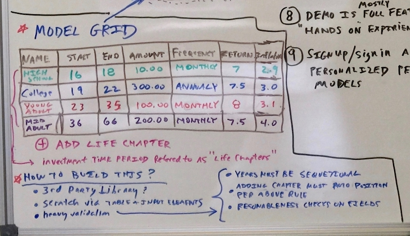
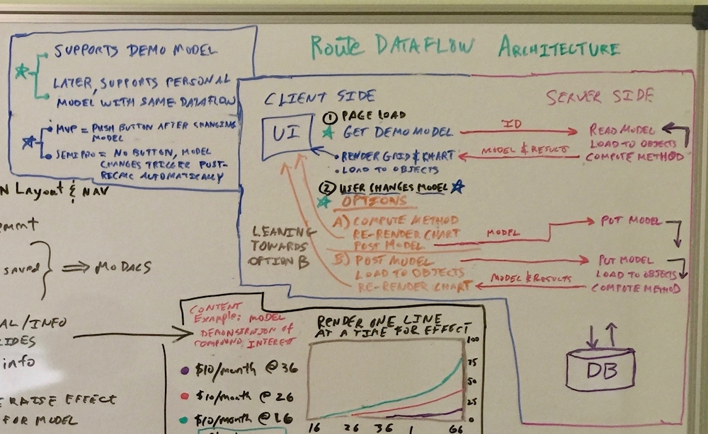
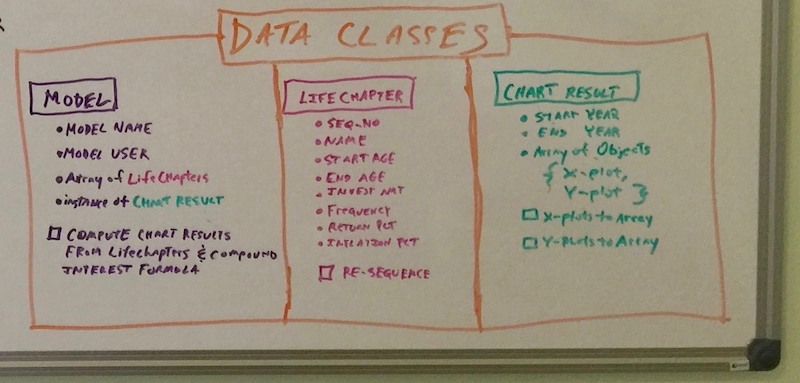
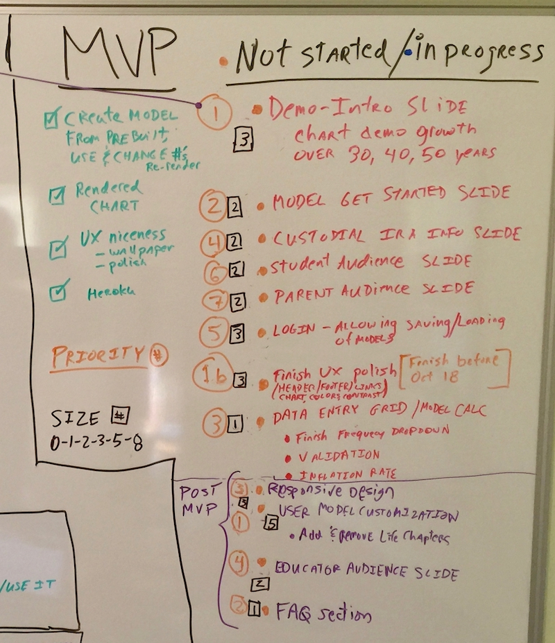
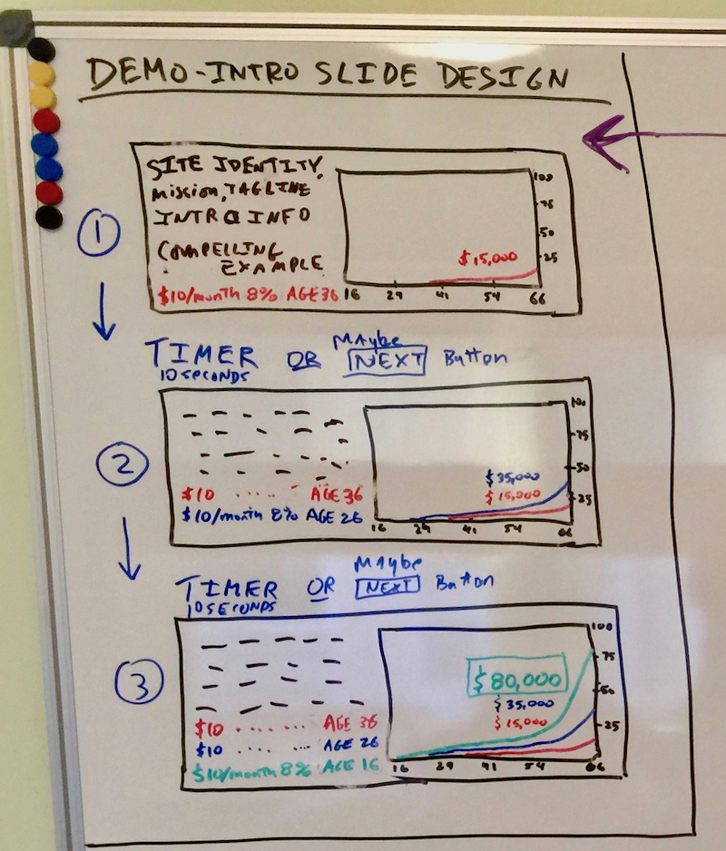
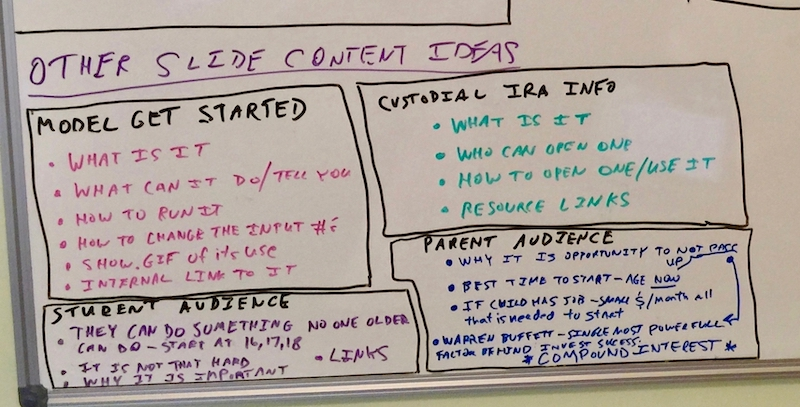

# 1650 - Youth Custodial IRA Portal

## Full Stack website to inform about Custodial IRAs 

## Detailed Design Elements

**Design Notes**

**UX**

- See site *moneyinstructor.com*

- UX whiteboard: - add notes below image

  

  

  

  Model Grid Element** 

  - Whiteboard - add notes below

    

**Route/Data Flow Architecture**

- Key Question:  Client side financial model calculation or Server side?Architecture whiteboard:  add notes below 

  

**Classes**

- Whiteboard - add notes below 

  

**MVP To-Do Priority List**

- Whiteboard - add notes below 

  

  

  **Intro-Demo Slide ideas**

  - Whiteboard - add notes below 

    

**Other Slide Content ideas**

- Whiteboard - add notes below 

  

**Login - Model Load/Save design**

- Whiteboard - add notes below image	
- ​	**TO DO - target date Sunday October 12th**