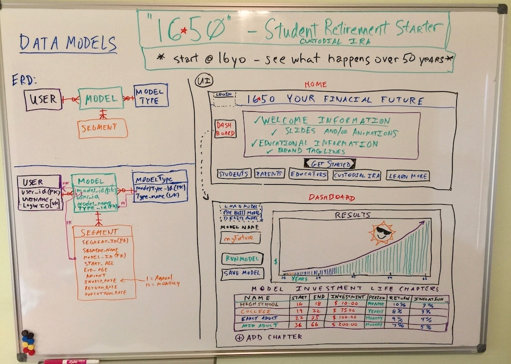

# 1650 - Youth Custodial IRA Portal

## Full Stack website to inform about Custodial IRAs 

## Project Proposal

- **UW Full Stack Coding Boot Camp - Flex**June - December 2019
- **Project 2 - Full Stack Web Application Project Proposal**
- Myles Carey - seanmyles@comcast.net
  **Project Requirements**
  	**Required for MVP:**
  		Node and Express web server
  - ​		MySQL with Sequelize ORM
  - ​		Use GET and POST routes for data management
  - ​		Deployed to Heroku (with data)
  - ​		Utilize at least one new library, package or technology
  - ​		Polished UI
  - ​		Folder structure meeting MVC paradigm
  - ​		Meets quality coding standards(indentation, scoping, naming, etc.)
  - ​		Must protect any API keys in Node with environment variables

​	**Nice to have - not required:**

- ​		Utilize Handlebars for server-side templating

- ​		Incorporate authentication (JSON Web Tokens, sessions, etc.)
- ​		User existing public dataset to power the database

​	Create migration strategy for sharing data across team members, e.g. a schema and seed sql files

## Proposal:  Youth Retirement Educational Calculator/Modeler

**Idea:**

Create a web page that introduces, educates and entertains High School students on the power of compound interest and shows what they can start **now** and what can be achieved via an IRA custodial retirement account by starting **today**.  Show how small amounts from your part-time job earnings can have **incredible** results over time.  Starting **young** is the key because while **time** is free it doesn’t wait for you. 

- Did you know anyone under 18 can open and contribute to a custodial ira if they have W2 earnings from a part time job or documentable jobs such as babysitting, lawn mowing, etc.
- Custodial IRA grow tax free the same as Roth IRAs and 401Ks
- The historical stock market return rate from 1957 to today is about 8%, from 1929 to today it is about 10%

**Target Audience:**

  High School Students, parents, High School Educators, general public

**Inspiration:**  Sharing the knowledge of early saving with others after having helped my 16yo start investing some of her part time job earning in a Custodial IRA.

**Problem:** USA rates of retirement savings could be alot better.  Educate when young so opportunity of early start / compound interest is **not** **lost**. 

**Whiteboard Design:**

**Feature Key:** 

- **MVP** (Minimum Viable Product)
- **Semi-Pro** (very important - possible promote to MVP; otherwise first up after MVP)
- **Pro** (future releases)

**User Stories** (**MVP** unless otherwise noted)

- As a user I am able to see and interact with demo that introduces and educates about the power of compound interest.
- As a user I can get a step-by-step walk thru on how to Get Started with the ModelerAs a user I can enter saving amounts and see results graphed in compelling and interesting manner.
- As a user I can create a Model with different saving amounts, interest rates, investment period (monthly or yearly) and return rates for a single time frame age 16 thru 66 - i.e. a simple introductory Model.  I can save and retrieve later and further modify.
- As a user I can start with a pre-built model that has multiple life chapters ( i.e. age ranges such as 16 - 18, 19 - 22, 23 - 35 and 36 - 66) and modify the saving amounts, interest rates, investment periods and return rates of each to my liking and save and retrieve and further modify.
- As a user i can create a Model with my own defined life chapters either from scratch or starting from a saved model or pre-built model.  I can add and delete life chapters of my model.  I can change all the attributes mentioned above.  **(Semi-Pro)**
- As a user when i enter amounts in the model the results graph is reactive and thus renders automatically without my pressing a “run model” button (**Semi-Pro**)
- As a user I can adjust my year segments for different rates of inflation **(Pro)**
- As a user I can see different models compared stacked in an A/B style comparison **(Pro)**
- As a user I can see information targeted at students and saving conceptsAs a user I can see information targeted at parents As a user I can see information targeted as Educators (**Pro**)
- As a user I can see information and links on how to open a Custodial IRA As a user I can see information and links on how to learn more about financial ideas in general

**MVP & Beyond - Features**

**Introduction / Welcome**

- Educational component demo (MVP)
- Slides, Images, Brand Taglines (things to think about), comparisons (ex: cost of latte or streamed movie = x $ if saved) (MVP)
- Animations (Pro), Knowledge games (Pro)

**Models**

- Hands on guided guided Get Started procedure  (MVP)
- Models that allow entry of saving amounts, investment period (monthly or yearly) and return rates (MVP)
- Ability to save, retrieve and alter models at a later time (MVP)
- Compound Interest model calculation applied monthly or yearly over years (MVP)
- Introduction Starter model with single life chapter (i.e. age 16 to 66  ) (MVP)
- Pre-built model with fixed multiple life chapters (16-18, 19-21, 22-35, 36- 66) (MVP)
- Additional Pre-built models (Semi-Pro)Model fully user configurable with multiple life chapters  (Semi-Pro)
- Adjust for inflation (Semi-Pro)
- Copy models and Save As (Pro)
- ResultsResults Graphing using a 3rd party js graphing library (MVP)
- Results Graph renders in a reactive manner - i.e. a user changing a model parameter will cause graph to re-compute/re-render without user pressing a “run model” button (Semi-Pro)
- Results Graph A/B Comparison (Pro)
- Graph Animations (Pro)

**User Login**

- Saved profiles with unique ID (MVP)
- Authentication (Pro)

**Audience - Additional Information**

- Students - information, links on saving concepts (MVP)
- Parents - background information / encouragement (MVP)
- Links to further information on starting a Custodial IRA (MVP)
- High School Educators - teaching curriculum (Semi-Pro)