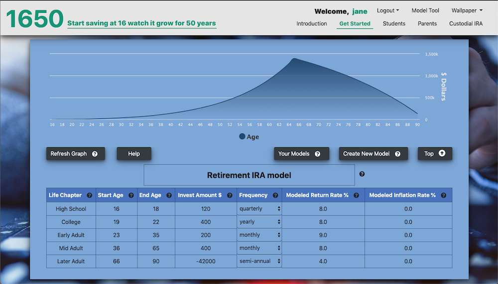

# 1650 - Youth Custodial IRA Portal

## Full Stack website to inform about Custodial IRAs 

## Description

This full stack web site is an information portal aimed at high school students and their parents.  It provides a high level introduction to compound interest, retirement investing, open a Custodial IRA for a minor and an easy and fun modeling calcuator that graphs hypothetical retirement results using a spreadsheet like grid for data input.

The has topic slides for induction to compound interest, how to use the model calculator, student finance, parent involvement and custodial IRAs.  There are links to external sites on the topic slides. 

The modeling calculator can be used without a login as guest.  Authentication signup and login allows for saving and loading of the models thru data persistance.  The UX is polished and features some extras such as wallpaper image choices with local storage being used to persist the choice when later returning to the sites.

The backend use mySQL, Sequelize and API routes for HTML and database operations.  Professional grade library HighCharts.js is used for the modeling calcuator chart and the introduction slide presentation.

- #### Front-End Technology

  - HTML, CSS, JavaScript (ES6 & some OOP), jQuery, Bootstrap, HighCharts.js

  #### Back-End Technology

  - Node.js, Express.js, mySQL, JavaScript (ES6 & some OOP), NPM packages (express, mysql, path, sequelize, passport), API routes, Heroku

## Details:

- #### Github project:  <a href="https://github.com/mylescarey2019/1650">1650 Teen Custodial IRA Planner</a>

- #### Deployed Heroku link:  <a href="https://ira1650.herokuapp.com/#">1650 Teen Custodial IRA Planner</a>

- #### For further design and development details see: 

  - #### [Project Proposal with User Stories](Proposal.md)

  - #### [Project Plan](ProjectPlan.md)

  - #### [Detail Design Elements](DetailDesign.md)

  - #### [Database Schema and SQL Queries](Database-Schema.md)

- #### Demo walkthru GIF : 

  - Use Cases seen in demo below

    - [x] Introduction slide animation
    - [x] Informational slides
    - [x] modeling calculator with graph used as site guest
    - [x] authentication
    - [x] saved and loaded models

    

  

  

#### Screen Captures:

Page upper section - introduction slide

Modeling Tool

Modal examples:

## Getting Started

### Native and NPM Packages Used

1. express  & express-session - for server and authentication support
2. passport & passport-local - for authentication
3. bcrypt & bcryptjs - for password hashing
4. mysql - for database connectivity
5. sequelize - for ORM database support
6. path - for absolute and relative path resolution

### Dependencies

- none - Note:  not fully responsive yet - best viewed at or above 1440x900 or larger

  but does support down to ipad(1024x768) and larger sizes such as 1366x778

### Installing

- none necessary - use link to page deployed on Heroku

### Executing program

- navigate thru slides via nav bar links or carousel 
- scroll down to access the modeling tool
- use modeling tool as guest - click into cells to changes values then refresh model to see graph updated
- signup and login to create models, save models and load saved models - see Your Models link in navbar
- for fun select from several wallpapers via nav bar dropdown

#### Planned/Possible Enhancements Backlog

- [x] clean up responsiveness - completed down to 1024x768
- [ ] strengthen model grid validations
- [ ] fine tune/improve media queries to provide better responsiveness
- [ ] replace/improve spreadsheet grid - allow adding and removing of rows
- [ ] try dynamic chart rendering on grid value change eliminating need for Refresh Model button
- [ ] database cleanup to remove guest models no longer being used
- [ ] complete calculator features:  allow monthly and yearly investment frequency, implement inflation correction
- [ ] improved Get Started slide by making the model how-to image have hotspots with popup modals for further explainations
- [ ] user preferences modal - move wallpaper setting into it; add settings for preset Modeled Return and Inflation rates
- [ ] improve slide content 
- [ ] password recovery
- [ ] multiple model plots on single graph for easy comparisons
- [ ] layout rework - consider moving from slide layout to traditional page sections accessed via scroll and links
- [ ] provide dynamic page footer attributions wallpaper images thanking given unsplash photographer

## Authors

Myles Carey 
mylescarey2019@gmail.com 

## Version History

- 1.0 - Initial Release  10/18/2019
- 1.0.1 - Mini-Sprint 1 release 10/23/2019
  - Two level NavBar with logged in User acknowlegement
  - masked password
  - hidden, but clickable diagnostic user & model information in left side of footer
  - Brand Logo now returns viewport to the first carousel slide
  - Help button on Model grid added - resets view port to the "Get Started" slide for model instructions
- 1.1 Sprint 1 release 10/25/2019 - improve responsiveness down to form factor 1024x768 (iPad)
- 1.2 Sprint 2 release 11/02/2019 - Capability to delete user models added
- 1.3 Sprint 3 release 11/05/2019 - UX improvements: slide text contrast, added symbols for CVD support,
      nav link to model tool
- 1.4 Sprint 4 release 11/10/2019 - UX improvements:  graph/grid screen fit, link to top of page, wallpaper none option
- 1.5 Sprint 5 release 11/11/2019 - UX improvements: symbols on slide for CVD support, model tool down 
button (manual scroll still available), increased nav bar visibilty of logged in user, login/signup triggers modal reminder to create or load model and auto-scrolls to model section on close, guest model is now cleared from page on login/signup, clarity on model button: (guests refresh the model/graph),logged in users save the model which also refreshs graph)
- 1.6 Sprint 6 release 2-8-2020 - added investment frequency options for annual, semi-annual and quarterly 
- 1.7 Planned sprint scheduled for February/2020 - option to set an inflation rate modifier

## License

## Acknowledgments

Thanks to beta testers - my 15yo & 17yo daughters and wife 

Thanks to unsplash photographers for slide and wallpaper images - individual attribution to be added to site footer in upcoming release

